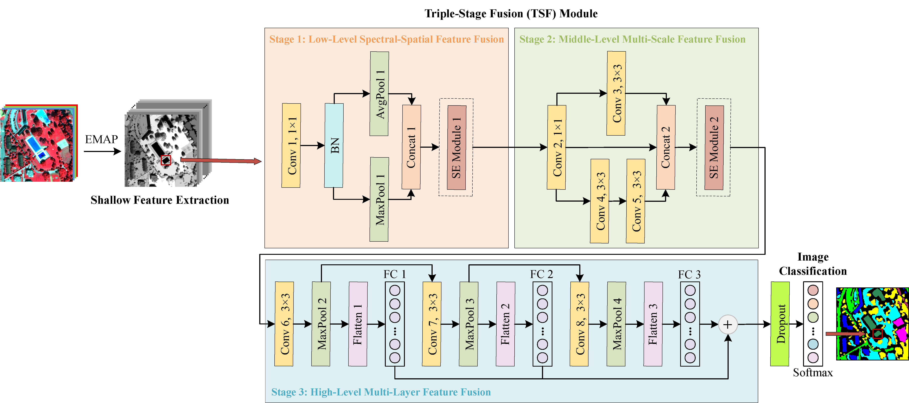

# SDF2N for VHR Remote Sensing Image Classification

It is the python-keras implementation of the paper:  A Shallow-to-Deep Feature Fusion Network for VHR Remote Sensing Image Classification

For more ore information, please see our published paper at [IEEE TGRS](https://ieeexplore.ieee.org/document/9785804)



## Prerequisites
```
Window 10
Python 3.6
CPU or NVIDIA GPU
CUDA 9.0
Keras 2.2.4
```
## Quick Start

You can run a demo to get started. 

```bash
python SDF2N_demo.py
```

## Prepare Datasets

## Using other dataset mode

In this case, the data structure should be the following:

```
"""
Image classification data set with pixel-level binary labels；
├─Image
├─Label
├─Train_set
└─Test_set
"""
```

## Citation

If you use this code for your research, please cite our papers.

```
@ARTICLE{9785804,
  author={Liu, Sicong and Zheng, Yongjie and Du, Qian and Bruzzone, Lorenzo and Samat, Alim and Tong, Xiaohua and Jin, Yanmin and Wang, Chao},
  journal={IEEE Transactions on Geoscience and Remote Sensing}, 
  title={A Shallow-to-Deep Feature Fusion Network for VHR Remote Sensing Image Classification}, 
  year={2022},
  volume={60},
  number={},
  pages={1-13},
  doi={10.1109/TGRS.2022.3179288}}
```

## Acknowledgments

Our code is inspired by [keras-MDFN](https://github.com/SicongLiuRS/Multitemporal-HR-Images-Classification).

 
